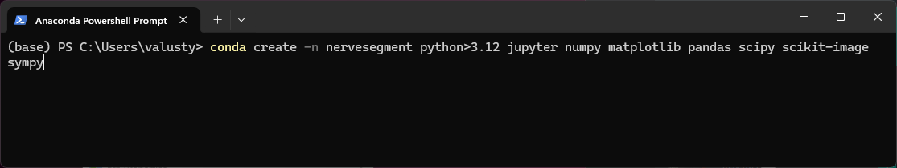
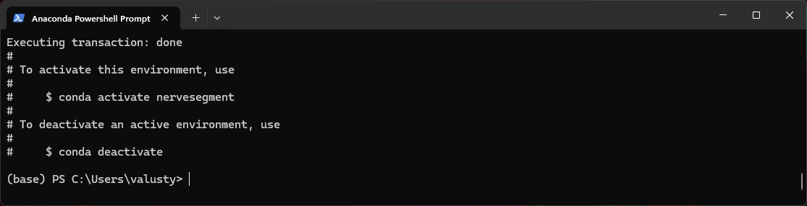
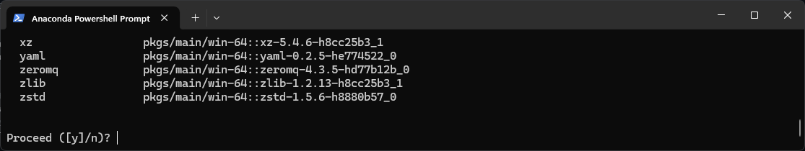
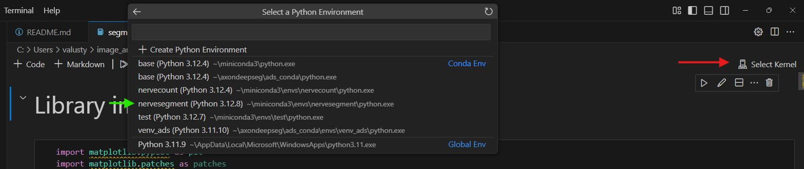

# Image segmentation for nerve morphometrics quantification

Цей репозиторій містить інструменти та приклади для сегментації зображень з метою детекції нервових відростків та мієлінових оболонок на імунофлуоресцентних зображеннях. У ньому надано приклади даних, скрипти та темплейти для аналізу морфометричних показників нервів.

## Структура репозиторію, або де та що можна знайти?

- **`info/`**
  - `segmentation_axons_explained.md`: Опис процесу сегментації зображень (_на прикладі аксонів_).

- **`data/`**

  _Через обмеження, данна папка відсутня безпосередньо в репозиторії. Дані для роботи можна завантажити [за посиланням](https://drive.google.com/drive/folders/10Wn-dTwN0UtLtcn8KfkROa7r5fPOKVH-?usp=drive_link)._ 
  -  `raw_data/`: Дані, для роботи.
  -  `example_image.tif`: Зображення, що було використане в якості прикладу.

 _Примітка:_ Через обмеження, данна папка відсутня в репозиторії. Дані для роботи можна завантажити [за посиланням](https://drive.google.com/drive/folders/10Wn-dTwN0UtLtcn8KfkROa7r5fPOKVH-?usp=drive_link). 

- **`notebooks/`**
  - `segmentation_axon.ipynb`: Jupyter Notebook з демонстрацією процесу підготовки зображень та їх сегментації (_на прикладі аксонів_).
  - `analysis_axon.Rmd`: Код з демонстрацією аналізу даних, отриманих на основі зображень (_поки не додано, на R_)
  - `segmentation_myelin.ipynb`: Jupyter Notebook з темплейтом для майбутньої сегментації мієлінових оболонок.
  - `analysis_myelin.Rmd`: Темплейт для аналізу морфометричних показників мієлінових оболонок, отриманих на основі зображень (_в процесі написання, на R_)

- **`results/`**
  - `results_axon/`: Папка з результатами сегментації аксонів:
    - `segmented_outputs_axon/`: Папка з результатами сегментації аксонів (_у формі зображень для кожного етапу сегментації_).
    - `segmented_data_axon/`: Папка з результатами сегментації аксонів (_у формі окремих .csv файлів для кожного початкового зображення_).
  - `results_myelin/`: Папка з результатами сегментації аксонів:
    - `segmented_outputs_myelin/`: Папка з результатами сегментації мієлінових оболонок (_у формі зображень для кожного етапу сегментації_).
    - `segmented_data_myelin/`: Папка з результатами сегментації мієлінових оболонок (_у формі окремих .csv для кожного початкового зображення_).

- **`screenshots/`** 

## Як почати роботу

### Що необхідно для сегментації

1. Завантажте менеджер оточень для встановлення бібліотек [miniconda](https://docs.anaconda.com/miniconda/).
2. Після встановлення miniconda, відкрийте Anaconda Prompt та створіть середовище для роботи:
   
   ``` bash
   conda create -n nervesegment python>3.12 jupyter numpy matplotlib pandas scipy scikit-image sympy
   ```
   По суті, це виглядає якось так:
   
   
   
   _Рис. 1. Створення середовища в conda prompt._

   Про коректне створення середовища буде свідчити наступне:
   
   
   
   _Рис. 2. Завершення створення середовища в conda prompt._

   Тепер, як власне вказано безпосередньо в condа, середовище можна активувати:
   
   ``` bash
   conda activate nervesegment
   ```

   ... aбо деактивувати:

   ``` bash
   conda deactivate nervesegment
   ```
3. Також, для зручності роботи, завантажте інтегроване середовище розробки [Visual Studio Code](https://code.visualstudio.com/). Перед роботою завантажте розширення для роботи на мові програмування Python:
      
   
   
   _Рис. 3. Завантаження розширення для роботи з мовою програмування Python в Visual Studio Code. Червоне - вкладка Extensions, для пошуку розширення. Зелений - необхідне розширення._
4. Оберіть Kernel в Visual Studio Code:
      
   
   
   _Рис. 4. Вибір Kernel в Visual Studio Code. Червоне - вкладка Kernel, для пошуку необхідного середовища. Зелений - необхідне середовище._ 


## Джерела
Репозиторій [BDS3_2024_img_analysis](https://github.com/wisstock/BDS3_2024_img_analysis.git), який був створений для курсу з аналізу зображень на Biological Data Science Summer School (_2024, Uzhhorod_) користувачем [wisstock](https://github.com/wisstock) (ліцензія CC BY 4.0) був основою для даного репозиторію. З даного репозиторію були запозичені елементи з README.md та BDS^3_2024_img_advanced.ipynb, які адаптовано під потреби нового проєкту. Рекомендую звернути увагу на даний репозиторій, особливо на ноутбуки BDS^3_2024_img_intro.ipynb та BDS^3_2024_img_advanced.ipynb

## Рекомендована література

## Ліцензія
Цей проект ліцензований відповідно до [Creative Commons Attribution 4.0 International](https://creativecommons.org/licenses/by/4.0/). Повний текст ліцензії можна знайти у файлі [LICENSE](LICENSE).
