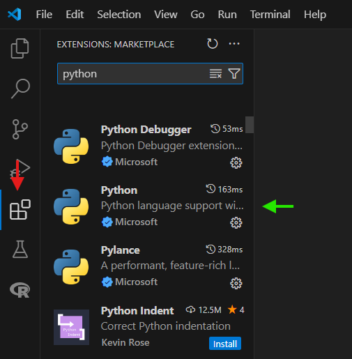

# Image segmentation for nerve morphometrics quantification

Цей репозиторій містить інструменти та приклади для сегментації зображень з метою детекції нервових відростків та мієлінових оболонок на імунофлуоресцентних зображеннях. У ньому надано приклади даних, скрипти та темплейти для аналізу морфометричних показників нервів.

## Структура репозиторію, або де та що можна знайти?

- **`info/`**
  - `segmentation_axons_explained.md`: Опис процесу сегментації зображень (_на прикладі аксонів_).

- **`data/`**
 _(через обмеження, данна папка відсутня безпосередньо тут. Дані для роботи можна завантажити [за посиланням](https://drive.google.com/drive/folders/1CIet-skyebHqLCbWpyw9ZFww3RY7ucQ8?usp=sharing))._ 
  -  `raw_data/`: Дані, для роботи.
  -  `example_image.tif`: Зображення, що було використане в якості прикладу.

- **`notebooks/`**
  - `segmentation_axon.ipynb`: Jupyter Notebook з демонстрацією процесу підготовки зображень та їх сегментації (_на прикладі аксонів_).
  - `analysis_axon.Rmd`: Код з демонстрацією аналізу даних, отриманих на основі зображень (_потребує корекції, буде завантажено в майбутньому_)
  - `segmentation_myelin.ipynb`: Jupyter Notebook з темплейтом для майбутньої сегментації мієлінових оболонок (_поки відсутній тут, буде завантажено згодом_).

- **`results/`**
  - `results_axon/`: Папка з результатами сегментації аксонів:
    - `segmented_outputs_axon/`: Папка з результатами сегментації аксонів (_у формі зображень для кожного етапу сегментації_).
    - `segmented_data_axon/`: Папка з результатами сегментації аксонів (_у формі окремих .csv файлів для кожного початкового зображення_).
    - `axon_data.csv`: Загальна таблиця зі скороченими даними для всіх зображень (_1 рядок - 1 зображення_)
    - `axon_full_data.csv`: Загальна таблиця зі повними даними для всіх зображень (_1 рядок - 1 аксон_)
  - `results_myelin/`: Папка з результатами сегментації аксонів (_поки відсутня тут, буде завантажена згодом_)

- **`screenshots/`** 

## Як почати роботу

### Що необхідно для сегментації

1. Завантажте менеджер оточень для встановлення бібліотек [miniconda](https://docs.anaconda.com/miniconda/).

2. Після встановлення miniconda, відкрийте Anaconda Prompt та створіть середовище для роботи:
   
   ``` bash
   conda create -n nervesegment python>3.12 jupyter numpy matplotlib pandas scipy scikit-image sympy
   ```
   По суті, це виглядає якось так:

   

   
   _Рис. 1. Створення середовища в conda prompt._

   Про коректне створення середовища буде свідчити наступне:
   
   

   
   _Рис. 2. Завершення створення середовища в conda._

   Тепер cередовище можна активувати:
   
   ``` bash
   conda activate nervesegment
   ```

   ... aбо деактивувати:

   ``` bash
   conda deactivate nervesegment
   ```

3. Також, для зручності роботи, завантажте інтегроване середовище розробки [Visual Studio Code](https://code.visualstudio.com/). Перед роботою завантажте розширення для роботи на мові програмування Python:
      
   
   
   _Рис. 3. Завантаження розширення для роботи з мовою програмування Python в Visual Studio Code. Червоне - вкладка Extensions, для пошуку розширення. Зелене - необхідне розширення._

4. Оберіть Kernel в Visual Studio Code:
      
   
   
   _Рис. 4. Вибір Kernel в Visual Studio Code. Червоне - вкладка Kernel, для пошуку необхідного середовища. Зелене - необхідне середовище._ 

### Як завантажити дані з репозиторію?

1. Активуйте середовище в conda prompt:

   ``` bash
   conda activate nervesegment
   ```
2. Скопіюйте посилання на репозиторій:

  

  _Рис. 5. Копіювання посилання. Червоне - вкладка на посилання. Зелене - копіювання посилання. Жовте - у випадку чого, вміст репозиторію можливо зберегти в вигляді архіву з сайту._

3. Клонуйте вміст в conda:

  ``` bash
  git clone https://github.com/valusty/image_analysis.git
  ```

4. Тепер всі дані звідси в вас завантажені локально на ваш пристрій, але для роботи ще необхідні зображення. Перейдіть на [гугл диск](https://drive.google.com/drive/folders/10Wn-dTwN0UtLtcn8KfkROa7r5fPOKVH-?usp=drive_link) та завантажте архів з папкою data.

5. Для зручності розархівуйте вміст безпосередньо в новозавантажену папку image_analysis.

## Джерела
Репозиторій [BDS3_2024_img_analysis](https://github.com/wisstock/BDS3_2024_img_analysis.git), який був створений для курсу з аналізу зображень на Biological Data Science Summer School (_2024, Uzhhorod_) користувачем [wisstock](https://github.com/wisstock) (ліцензія CC BY 4.0), став основою для цього проєкту. Елементи з README та BDS^3_2024_img_advanced.ipynb були адаптовані з оригінального ресурсу під потреби нового проєкту. Рекомендую ознайомитись з даним проєктом, особливо звернути увагу на ноутбуки BDS^3_2024_img_intro.ipynb та BDS^3_2024_img_advanced.ipynb, а також заглянути в список рекомендованої літератури.

## Рекомендовані посилання

[Introduction to Image Processing with Python](https://datacarpentry.github.io/image-processing/01-introduction.html)

[Python Підручник](https://w3schoolsua.github.io/python/index.html#gsc.tab=0)

[SciPy в Python](https://www.guru99.com/uk/scipy-tutorial.html)

[SciPy User Guide](https://docs.scipy.org/doc/scipy-1.15.0/tutorial/index.html)

[NumPy User Guide](https://numpy.org/doc/stable/user/index.html#user)

[Matplotlib Підручник](https://w3schoolsua.github.io/python/matplotlib_intro.html#gsc.tab=0)

[Using Matplotlib](https://matplotlib.org/stable/users/index)

[Scikit-image User Guide](https://scikit-image.org/docs/stable/user_guide/install.html)

[Working With Scikit-image](https://datacarpentry.github.io/image-processing/03-skimage-images.html)

[10 Minutes to Pandas](https://pandas.pydata.org/pandas-docs/stable/user_guide/10min.html)

[Pandas Cookbook](https://pandas.pydata.org/pandas-docs/stable/user_guide/cookbook.html)

## Може бути цікаво

[Ten Simple Rules for Better Figures](https://inria.hal.science/hal-01063732/document)

[Learning Python, Fourth Edition by Mark Lutz](https://cfm.ehu.es/ricardo/docs/python/Learning_Python.pdf)

## Ліцензія
Цей проект ліцензований відповідно до [Creative Commons Attribution 4.0 International](https://creativecommons.org/licenses/by/4.0/). Повний текст ліцензії можна знайти у файлі [LICENSE](LICENSE).
